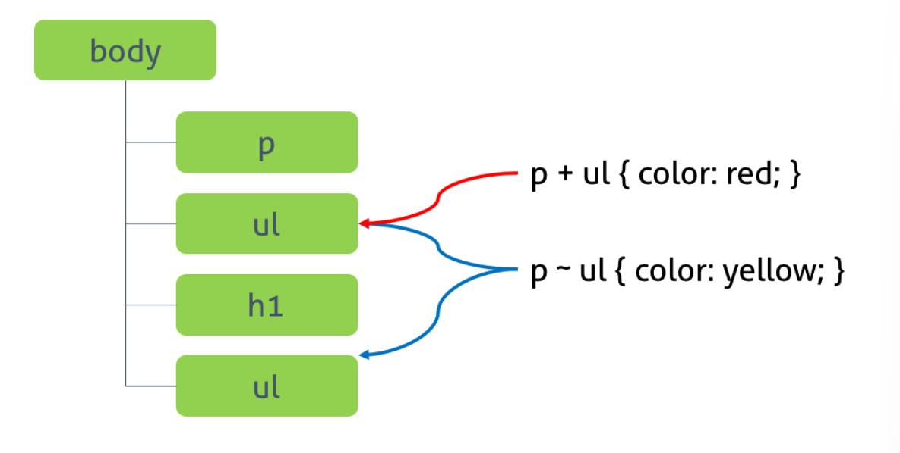

# CSS Selectors
## 1. 기본 선택자
  ### 1.1 결합 선택자
  - 요소간의 계층 관계를 결합하여 특정요소나 하위 요소를 선택한다.<br>
  - 일치선택자(matching selector/attribute selector)
  ```css
  /* (1) 일치선택자 */

  /*
   기본 형식 
  => 속성 type를 가지고 있는 태그 모두 
  <input type="password" placeholder="비밀번호 입력">
  */
  [type] {
    border: 1px solid black;
  }

  /*
   정확히 일치 
  => input 태그 중에 type이 "text"인 경우 
  <input type="text" placeholder="텍스트 입력">
  */
  input[type="text"] {
      border: 1px solid blue;
  }

  /*
   시작 문자열 
  => 속성의 문자열의 시작이 "btn-"과 일치한 경우 
  <button class="btn-primary">Primary Button</button>
  */
  [class^="btn-"] {
      background-color: yellow;
  }

  /*
   끝 문자열 일치 
  => 속성값의 끝 문자열이 ".pdf"와 일치한 경우
  
  */
  a[href$=".pdf"] {
      color: red;
  }
  <a href="document.pdf">Download PDF</a>

  /*
   포함 문자열 일치 
  => 속성값의 문자열에 "tutorial을 포함하는 요소" 
  <p title="CSS tutorial">CSS Tutorial</p>
  */
  [title*="tutorial"] {
      font-weight: bold;
  }

  /*
   공백으로 구분된 단어 일치 
  => class 속성 값중에 "btn"이 포함된 요소
  <p class="btn info">Button-like Paragraph</p>
  */
  [class~="btn"] {
      padding: 10px;
  }

  /*
  대시로 구분된 값 일치
  => 특정 속성 값이 주어진 값이나 값 뒤에 하이픈(-)이 오는 경우를 선택합니다.
  => lang 속성값이 en 또는 en-으로 시작하는 요소
  <p lang="en-US">English Content</p>
  */
  [lang|="en"] {
      color: green;
  }
  ```
  - 자식 선택자 : E의 자식(직계) 요소를 선택  
  자손 선택자 : E의 자손(하위 전체) d요소를 선택
  ```css
  /* div 바로 하위 단계에 있는 p들만 선택 */
  div > p {
    color: green;
  }

  /* div 전체 하위에 있는 p들만 선택 */
  div p {
    color: green;
  }

  ```
  ### 1.2 동위 선택자
  - 동위 관계란 같은 부모 요소를 가지고 있는 요소들을 의미
  ```css
  /* 인접 형제 선택자 : 다음 형제 요소 하나만 선택*/
  p+ul{
    margin: 0 auto;
    width: 1080px;
  }
  /* 일반 형제 선택자 : 다음 형제 요소 모두 선택*/
  p~ul{
  margin: 0 auto;
  width: 1080px;
  }
  ```
  

  ### 1.3 그룹 선택자
  - 여러 선택자를 한꺼번에 적용하고 싶을때, 쉼표(,)로 구분해서 연결
  ```css
  h2 { color: navy; }

  h2, h3 { text-align: center; }

  h2, h3, p { background-color: lightgray; }
  ```

## 2. 의사 선택자
의사 선택자는 요소를 직접 선택하지 않고 해당 요소의 상태에 따라 선택하여 꾸며주는 것을 의미한다.
  ### 2.1 의사 요소
  |선택자|설명|
  |---|---|
  |```::first-letter```|콘텐츠의 첫글자를 선택|
  |```::first-line```|콘텐츠의 첫줄을 선택<br> 블록 요소에만 적용 가능|
  |```::after```|콘텐츠의 뒤에 위치하는 공간 선택<br> 일반적으로 content 프로퍼티와 함께 사용|
  |```::before```|콘텐츠의 앞에 위치하는 공간 선택<br> 일반적으로 content 프로퍼티와 함께 사용|
  |```:selection```|드래그한 콘텐츠를 선택 <br>iOS Safari 등 일부 브라우저에서 동작 않는다.|
  ```css
  /* p 요소 콘텐츠의 첫글자를 선택 */
  p::first-letter { font-size: 3em; }

  /* p 요소 콘텐츠의 첫줄을 선택 */
  p::first-line   { color: red; }

  /* h1 요소 콘텐츠의 앞 공간에 content 어트리뷰트 값을 삽입한다 */
  h1::before {
    content: " HTML!!! ";
    color: blue;
  }

  /* h1 요소 콘텐츠의 뒷 공간에 content 어트리뷰트 값을 삽입한다 */
  h1::after {
    content: " CSS3!!!";
    color: red;
  }

  /* 드래그한 콘텐츠를 선택한다 */
  ::selection {
    color: red;
    background: yellow;
  }
  ```
  ** <strong>가상 클래스와 의사선택자를 구분하기 위해 이중 콜론(::) 사용 권장</strong><br>
  [:before :after 와 ::before ::after의 차이점](https://inpa.tistory.com/entry/CSS-%F0%9F%93%9A-before-after-%EC%99%80-before-after%EC%9D%98-%EC%B0%A8%EC%9D%B4%EC%A0%95%EB%A6%AC)
  ### 2.2 의사 클래스
  - html 요소의 특별한 상태(state)를 명시할 때 사용하는 선택자<br>
  - 
  | 의사 클래스       | 설명                                                                 |
|-------------------|----------------------------------------------------------------------|
| `:link`           | 방문하지 않은 링크 요소                                              |
| `:visited`        | 방문한 링크 요소                                                     |
| `:hover`          | 사용자가 마우스를 올려놓은 요소                                      |
| `:active`         | 사용자가 활성화된 요소를 선택할 때 (예: 링크를 클릭할 때)            |
| `:focus`          | 포커스가 맞춰진 요소                                                 |
| `:checked`        | 선택된 `<input>` 요소 (체크박스 또는 라디오 버튼)                   |
| `:enabled`        | 활성화된 요소                                                        |
| `:disabled`       | 비활성화된 요소                                                      |
| `:valid`          | 올바른 값이 있는 `<input>` 요소                                      |
| `:invalid`        | 잘못된 값이 있는 `<input>` 요소                                      |
| `:default`        | 기본 옵션인 `<input>` 요소                                           |
| `:empty`          | 자식 요소가 없는 요소                                                |
| `:first-child`    | 부모 요소의 첫 번째 자식 요소                                        |
| `:first-of-type`  | 특정 타입의 첫 번째 자식 요소                                        |
| `:in-range`       | 값이 유효한 범위 내에 있는 `<input>` 요소                            |
| `:indeterminate`  | 체크박스가 체크되지 않은 상태인 `<input>` 요소                       |
| `:last-child`     | 부모 요소의 마지막 자식 요소                                         |
| `:last-of-type`   | 특정 타입의 마지막 자식 요소                                         |
| `:not(selector)`  | 지정한 선택자와 일치하지 않는 모든 요소                              |
| `:nth-child(n)`   | n번째 자식 요소 (n은 숫자, 공식, 키워드)                             |
| `:nth-last-child(n)` | 마지막부터 n번째 자식 요소 (n은 숫자, 공식, 키워드)               |
| `:nth-last-of-type(n)` | 특정 타입의 마지막부터 n번째 자식 요소 (n은 숫자, 공식, 키워드)|
| `:nth-of-type(n)` | 특정 타입의 n번째 자식 요소 (n은 숫자, 공식, 키워드)                 |
| `:only-of-type`   | 부모 요소 내에서 특정 타입의 유일한 자식 요소                        |
| `:only-child`     | 부모 요소 내에서 유일한 자식 요소                                    |
| `:optional`       | 선택 사항인 `<input>` 요소                                           |
| `:out-of-range`   | 값이 유효한 범위 밖에 있는 `<input>` 요소                            |
| `:placeholder-shown` | placeholder 텍스트가 보이는 `<input>` 요소                        |
| `:read-only`      | 읽기 전용 요소                                                       |
| `:read-write`     | 읽기/쓰기 가능한 요소                                                |
| `:required`       | 필수 입력 요소                                                      |
| `:root`           | 문서의 루트 요소 (예: `<html>`)                                      |
| `:target`         | 현재 활성화된 대상 요소 (예: URL의 앵커 링크에 해당하는 요소)         |
- 예시
  ```css
  /* a 요소가 방문하지 않은 링크일 때 */
  a:link { color: orange; }

  /* a 요소가 방문한 링크일 때 */
  a:visited { color: green; }

  /* a 요소에 마우스가 올라와 있을 때 */
  a:hover { font-weight: bold; }

  /* a 요소가 클릭된 상태일 때 */
  a:active { color: blue; }


  /* input 요소가 사용 가능한 상태일 때,
  input 요소 바로 뒤에 위치하는 인접 형제 span 요소를 선택 */
  input:enabled + span {
    color: blue;
  }

  /* input 요소가 사용 불가능한 상태일 때,
      input 요소 바로 뒤에 위치하는 인접 형제 span 요소를 선택 */
  input:disabled + span {
    color: gray;
    text-decoration: line-through;
  }

  /* input 요소가 체크 상태일 때,
      input 요소 바로 뒤에 위치하는 인접 형제 span 요소를 선택 */
  input:checked + span {
    color: red;
  }


  input[type="text"]:valid {
    background-color: greenyellow;
  }

  input[type="text"]:invalid {
    background-color: red;
  }
  ```
  - 부정 선택자 : A 중에 B가 아닌 것만 선택
  ```css
  /* input 요소 중에서 type 어트리뷰트의 값이 password가 아닌 요소를 선택 */
  input:not([type=password]) {
    background: yellow;
  }
  ```
  ### 2.3 구조 의사 클래스
  - 계층 구조에서 특정 위치에 있는 요소를 수학적인 값으로 선택할 수 있다.
  - ```:first-child```, ```last-child```
  ```css
  /* 형제 요소 중 첫번째 요소와 선택한 타입이 일치하면 선택 */
  span:first-child /* 첫번째 자식(span)과 선택자(span)가 일치하면 적용 */

  p:first-child  /* 첫번째 자식(span)과 선택자(p)가 불일치하여 미적용 */

  /* 형제 요소 중 마지막 요소와 선택한 타입이 일치하면 선택 */
  p:last-child  /* 마지막 자식(p)과 선택자(p)가 일치하면 적용 */

  span:last-child /* 마지막 자식(p)과 선택자(span)가 불일치하여 미적용 */
  ```
  - ```nth-child(n)``` : 형제 요소 중 n번째 요소와 선택한 타입이 일치하면 선택 <br>
  - 형태 자체로 이해하는게 훨씬 쉽다! <strong>n에 0부터 들어가고 자연수만 해당된다고 생각하자</strong>
  - 선택자를 두번 사용하여 교집합인 요소만 선택할 수 있다.

  | 예시| 설명| 코드 예시|
  |---------------------|--------------------------------------------------------------------------------------------|-----------------------------------------|
  | `:nth-child(2)`     | 부모 요소의 두 번째 자식 요소를 선택                               | `li:nth-child(2) { color: blue; }`      |
  | `:nth-child(odd)`   | 부모 요소의 홀수 번째 자식 요소를 선택                             | `li:nth-child(odd) { background: #ccc; }` |
  | `:nth-child(even)`  | 부모 요소의 짝수 번째 자식 요소를 선택                             | `li:nth-child(even) { background: #eee; }` |
  | `:nth-child(3n)`    | 부모 요소의 3의 배수 번째 자식 요소를 선택                        | `li:nth-child(3n) { font-weight: bold; }` |
  | `:nth-child(3n+1)`  | 부모 요소의 3의 배수 + 1 번째 자식 요소를 선택 (1, 4, 7, ...)      | `li:nth-child(3n+1) { color: red; }`    |
  | `:nth-child(3n-1)`  | 부모 요소의 3의 배수 - 1 번째 자식 요소를 선택 (2, 5, 8, ...)      | `li:nth-child(3n-1) { color: green; }`  |
  | `:nth-child(-n+3)`  | 부모 요소의 처음 세 개 자식 요소를 선택                           | `li:nth-child(-n+3) { font-style: italic; }` |
  | `:nth-child(n+4)`   | 부모 요소의 네 번째 이후 모든 자식 요소를 선택                    | `li:nth-child(n+4) { text-decoration: underline; }` |
  | `:nth-child(2n+3)`  | 부모 요소의 2의 배수 + 3 번째 자식 요소를 선택 (3, 5, 7, 9, ...)   | `li:nth-child(2n+3) { color: purple; }` |
  | `:nth-last-child(2)`| 부모 요소의 마지막에서 두 번째 자식 요소를 선택                   | `li:nth-last-child(2) { color: orange; }` |
  | `:nth-of-type(2)`   | 부모 요소의 특정 타입의 두 번째 자식 요소를 선택                   | `p:nth-of-type(2) { color: blue; }`     |
  | `:nth-last-of-type(2)` | 부모 요소의 특정 타입의 마지막에서 두 번째 자식 요소를 선택      | `p:nth-last-of-type(2) { color: blue; }` |

- 형재 요소 중에 선택 : ```type```

|요소|설명
|---|---|
|```p:first-of-type()```|부모 안에 모든 p요소 중 첫번째 p요소 선택 |
|```p:lastof-type()```|부모 안에 모든 p요소 중 마지막 p요소 선택|
|```p:nth-of-type(1)```|부모 안에 요소 중 첫번째 p요소 선택|
|```p:nth-of-type(2n+1)```|부모안에 p요소 중 첫번째부터 2번째마다 선택 |

